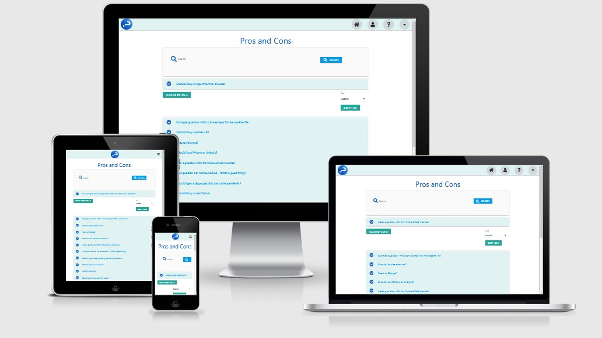
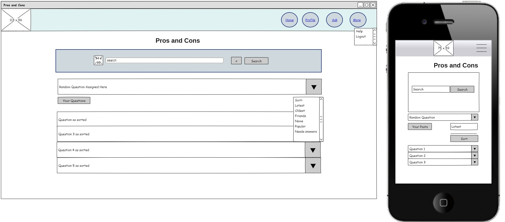
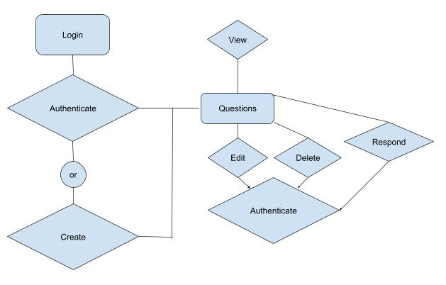
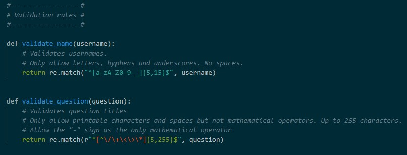

# Pros and Cons - A social media phenomena

[](https://pros-and-cons-1.herokuapp.com/)

Site: <https://pros-and-cons-1.herokuapp.com/>

## CONTENTS

- [Description](#description)
  - [UX](#ux)
    - [Goals](#site-goals)
    - [User Stories](#user-stories)
    - [Wireframes](#wireframes)
      - [Wireframe Images](#wireframe-images)
    - [Views and Data Structure](#views-and-data-structure)
    - [Design](#design)
      - [Typography](#typography)
      - [Color Scheme](#color-scheme)
  - [Features](#features)
    - [Existing Features](#existing-features)
      - [Account Registration](#account-registration)
      - [User Session](#user-session)
      - [Questions Page](#questions-page)
      - [Ask Questions](#ask-questions)
      - [Search Questions](#search-questions)
      - [Profile Page](#profile-page)
      - [Friends](#friends)
      - [Help](#help)
      - [Security](#security)
    - [Features Left to Implement](#features-left-to-implement)
  - [Technologies Used](#technologies-used)
  - [Tools Used](#tools-used)
  - [Media](#media)
  - [API](#api)
  - [Testing](#testing)
  - [Deployment](#deployment)
  - [Known Bugs](#known-bugs)
  - [Version Control](#version-control)
  - [Admin](#admin)
    - [Admin Responsibilities](#admin-responsibilities)
  - [Acknowledgements](#acknowledgements)

## DESCRIPTION

**Pros and Cons** is a social media website aimed at bringing people from around the world together to answer user based questions on any topic imaginable. Users will have other users answer their question with the pros and cons of their upcoming decisions. The site will mimic similar social media sites and users can only answer questions when they are logged in. Users will be able to easily register and currently will not require any identification. All users will need to login to answer questions is a user name and password. Users will be able to allow public responses to their questions, or responses from their friends only.



## UX

### SITE GOALS

The basis for production of Pros and Cons was to have an all-inclusive social media site allowing users to ask questions and have responses from friends, family and even people they have yet to meet. User experience and ease of use were the main focuses for the site. This meant keeping away from an intrusive social media platform for one that requires very little input from users byt was still technically advanced and allows users to interact no matter their level of expertise.

The design and layout was inspired by current social media giants as well as the Code Institute's Task Manager application. This mean that there was a balance in form and user interactivity and functionality.

### USER STORIES

- As a user, I want to be able to easily join a web application without the need to provide email addresses.
- As a user, I want to be able to ask questions and view the replies as they occur.
- As a user, I want to be able to update my profile to reflect who I am and where I am from.
- As a user, I want to be able to delete a question if it is no longer required
- As a user, I want to be able to search through the questions and sort by popularity, time added, who added them and my own or friends' questions.
- As a user, I want to be able to search for friends' profiles based on their username, city, or country.
- As a user, I want to be able to edit questions that I have inputted.
- As a user, I want to add friends so they can see questions only designed for them.
- As a user, I want to unfriend people if the friendship has not worked out the way it was anticipated.
- As a user, I want to be able to add a pro or con as a reply to any question that was open for me to do so.
- As a user, I want to be able to feel safe on the social media platform and can reach out to administrators if required.
- As a user, I want to be able to login and stay logged in if I choose or choose to logout at any point.
- As a friend of the user, I want to be able to see just their questions.
- As a user, I want to be able to see who is answering my questions.

- Pros and Cons is a social media website that focuses on user's asking questions that they'd like to weigh up all possibilities before carrying out the said question; users can:

  - New Users can:

    - Register with a unique username and password without special characters

    - Stay logged in after registration without the need to continually sign in by simply clicking the checkbox at the bottom of the registration page

    - Check their password is correct before registering, a new user can not register if passwords do not match
  
  - Existing users who are logged in will be able to:

    - View the site and all questions that are open for public view or are friends with the logged in user

    - Sort all the questions by date added latest and oldest, friends only, user's posts only

    - Send and accept friend requests

    - Search for new friends by username, first name, last name, country and state

    - View friends profiles to see their questions

    - Adjust their profile to include their first name, last name, country and state as well as a hidden birthday

    - Change their profile picture based on sex/gender to either male, female, non-binary or rather not say, all fields in the profile are optional

    - Click on the home button to view all questions, including questions from the user's friends that are set to "friends only"

    - Click on any question on the questions page, read it and choose whether to add a pro or a con to that question

    - Adding a pro or a con opens the question to the browser so the user can add multiple pros and cons

    - Click on the person who created the question to see their profile

    - Send a friend request via the profile page of a viewed profile

    - Click on a question to open it in the browser or just browse the question from the homepage

    - Write a pro or a con on any browsed question on the homepage which then opens the question in the browser window for more pros and cons to be added

    - Write their own question via the "ask questions" link in the header

    - Add a title to the question and a body for more explanation

    - Set the question to public, allowing anyone to answer or to "friends only" meaning only friends can answer

    - View profiles of friends and unfriend them if needed

    - Finish a question they have started so that no more responses can be added

    - Edit or update a question the user started

    - Delete a question that the user started

    - Search for questions based on keywords

  - Users who are not logged in can:

    - View all open questions that do not have the "Friends Only" switch set to "on"

    - View the profile of the user who wrote the question

    - Search for questions
  
  - All users, logged in or not can:

    - View the site on mobile, tablet, desktop or any device with a web browser and an internet connection

To avoid excessive spamming or unsolicited messages, users must be logged in to add questions or pros and cons. Non-logged in users do not have a profile page, but can view registered users profiles, but can not add friendships.

### WIREFRAMES

Wireframes were originally developed using the [Pencil Project](https://pencil.evolus.vn/). Although original Wireframes, before development started were built using Balsamiq, very little change from the initial design were made. The Pencil Project wireframes are a basic layout and excluding any logos or images. See also: [Wireframes](https://github.com/pauld0051/pros_and_cons/tree/master/static/images/wireframe)



#### Wireframe Images

- [login](static/images/wireframe/login.jpg)
- [register](static/images/wireframe/register.jpg)
- [ask questions](static/images/wireframe/ask.jpg)
- [view question](static/images/wireframe/question.jpg)
- [profile](static/images/wireframe/profile.jpg)
- [help](static/images/wireframe/help.jpg)

All wireframes are located on a document here:

- [wireframes](static/images/wireframe/wireframes_pros_and_cons.pdf)

### VIEWS AND DATA STRUCTURE

Pros and Cons was a relatively ambitious project to use the likes of MongoDB to produce a social media platform. Although some details did exist of previous attempts, none of these were used in the design or data structure. Instead, as user stories were being met, advancements were made for the routes on whether the user was creating, reading, updating, or deleting.



Figure 1: *an example of a flow diagram showing the hierarchy of events for a user to view, edit, delete or respond to a question.*

Data validation was required for all user entries and updates. These varied depending on the type of input. All data validation processes were stored in a separate file, validate_funcs.py.



Figure 2: *although other validation techniques were employed, they all ultimately prevent malicious code injection. All validation is done in both front and backend coding. The variation between the two regex codes is for the username to allow only letters or numbers, but questions are not allowed mathematical operators. The "[^" in username disallows these characters.*

User character input is limited to 255 characters for titles and pro and con replies, 1020 characters for textarea inputs, and up to 26 characters for names. This is consistent in both front and backend code. Birth dates are validated in the front end by using a Materialize date-picker and are subsequently validated at the backend by checking the format of the entry.

## DESIGN

The application was built using [Materialize](https://materializecss.com/) and its responsive grid system. The inspiration for the theme was inspired by [Code Institute](https://codeinstitute.net/)'s [Task Manager](https://flask-task-management-pd0051.herokuapp.com) application. Some of the Materialize styles were overwritten in a local CSS file: [style.css](static/css/style.css).

Fonts and colors were based entirely on Materialize's font structure to give the application a distinctive but yet familiar appeal.

### TYPOGRAPHY

Materialize uses [Roboto 2.0](https://fonts.google.com/specimen/Roboto?preview.text_type=custom) as a standard font.

### COLOUR SCHEME

Materialize uses a series of colour from a selective pallet: [Materialize Colour Schemes](https://materializecss.com/color.html)

#### Headings

All headings using a heading tag were one of the following colours:

-  `#1565c0 - blue-text text-darken-3`
-  `#01579b - light-blue-text text-darken 4`
-  `#c62828 - red-text text-darken-3`

#### Text

Text colours use the standard Materialize and browser font colours as well as some minor changes for various text such as in the profile names. All icons are from the [Fontawesome](https://fontawesome.com/) library. The following colours were used:

-  `#607d8b - blue-grey-text`
-  `#01579b - light-blue-text text-darken 4`
-  `#212121 - grey-text text-darken-4`
-  `#1565c0 - blue-text text-darken-3`
-  `#ef5350 - red-text lighten-1`


#### Buttons

Button colours were based on the following. All buttons contained white text or icons to help overcome those with colour-blindness:

-  `#1565c0 - blue darken-3`
-  `#039be5 - light-blue darken-1`
-  `#1e88e5 - blue darken-1`
-  `#b71c1c - red darken-4`
-  `#4caf50 - green`
-  `#d32f2f - red darken-2`
-  `#cfd8dc - blue-grey lighten-4` (navigation)
-  `#26a69a - teal lighten-1`

#### Cards and Panels

-  `#fafafa - grey lighten-5`
-  `#e0f2f1 - teal lighten-5`
-  `#b2dfdb - teal lighten-4`

#### Navbar

-  `#e0f2f1 - teal lighten-5`

All colour palettes were downloaded from [ColorHexa](https://www.colorhexa.com/) and resized in [Windows Paint 3D](https://www.microsoft.com/en-us/p/paint-3d/9nblggh5fv99?activetab=pivot:overviewtab).

## FEATURES

### EXISTING FEATURES

#### Account Registration

Users can register an account via the [registration](https://pros-and-cons-1.herokuapp.com/register) page.

- New users can register their account using letters and numbers for a username. There is no need to include an email at this time.
- The account name must pass validation and:
  - not include anything other than letters, numbers, hyphens and underscores and contain no spaces
  - not be the same as any previously registered name
  - be between 5 and 15 characters in length
  - have a validated password that is input twice for verification and be a minimum of 8 characters

Users can access the [terms and conditions](http://pros-and-cons-1.herokuapp.com/policies/terms) and subsequently the [privacy](http://pros-and-cons-1.herokuapp.com/policies/privacy) statements from the registration page.

#### User Session

- Existing users can log into their account using their chosen username and password
- If the "Remember me..." checkbox is ticked, the session will persist after the browser is closed
- Users can log out of their account and close the session
- If a user tries accessing certain pages or features from the application while logged out, they will be redirected to [login](https://pros-and-cons-1.herokuapp.com/login)

#### Questions Page

Whether logged in or not, users can view the [questions page](https://pros-and-cons-1.herokuapp.com/get_questions). This is where users can view questions and if logged in, users can answer questions with pros and cons. Logged in users can also sort the questions by "friends" or see their own questions they have asked.

Logged in users can sort questions by:

- Latest / the most recent asked questions
- Oldest / the oldest questions asked
- Friends / see only questions friends have asked
- Name / order posts created by users alphabetically
- Popular / posts with the most replies are at the top
- Needs answers / posts that have no replies are located at the top

Users that are not logged in can sort by the same categories, except for "Friends".

A separate button exists so logged in users can access their own questions only. From there they can sort their posts by:

- Latest
- Oldest
- Popular
- Needs answers

All questions are in a collapsed form and only the question title and a down-pointing chevron are visible. Users can click on the chevron to view individual posts and see the question text and any replies from within the opened accordion style collapsible. Users can also click on the title to open that question in the browser tab only. This allows for entry of pros and cons to the same item without refreshing back to a collapsed accordion. The opened question displays as though it is still accordion style, however, the chevron is replaced with a question mark and the question title is no longer in hyperlink-blue.

All questions have the same format:

- Question title
- Question text
- Two cards, side by side, one for Pros (on the left) and Cons (on the right)
- If users are logged in, they will see an input field for pros and cons with a submit button
- Users who are not logged in do not see any place for input or any submit buttons
- In italics, directly below the pros and cons cards shows who created the question, the date and time when the question was created and, if edited, the date and time of the latest edit
- A globe icon is depicted for all public questions and a friends icon for questions that are for friends only. Users who are not friends with the post owner will only be able to see their public posts
- Users that are logged in and are the post owner will see three buttons, Finish - Edit - Delete
  - Finish - this closes a question for further commenting. Italic text below the created by text states the question is closed for further commenting. Users can no longer submit pros and cons to this post and the post owner can no longer edit the post. However, they can delete the post if they see fit
  - Edit - users can edit their posts' title and text but are still bound by the rules of no mathematical operators in the text
  - Delete - removes the post and all replies in the pros and cons section. Users who attempt to access a post that is no longer available will get the 404 page error
- From the view question page, if a user had clicked on the title link from the questions page or a profile page, all users (logged in or not) can share the question to Facebook or to Twitter

An example question is set up here: [http://pros-and-cons-1.herokuapp.com/view_question/6040989f61e7e8310f344aa0](http://pros-and-cons-1.herokuapp.com/view_question/6040989f61e7e8310f344aa0). This can be viewed by anyone.

#### Ask Questions

The [ask questions](http://127.0.0.1:5000/add_question) link is only available to logged in users. Here a session user can input a question title and text. This is also where users can choose whether to make the post public or for friends only.

- Public posts / questions can be viewed by anyone and answered by logged in users
- Friends only / questions can only be viewed by the user's friends and the site creator for protection of all users

Users who are asking questions can use all characters except for mathematical operators as bound by a backend regex.

#### Search Questions

Users can search for keywords in question titles or text. The search is not case sensitive.

#### Profile Page

Only logged in users have access to their profile page. All users, logged in or otherwise, have access to view profiles by clicking on the "created by" link to the username on any question. Users who are logged in can also search for profiles from the profile page. A user can see if any friend requests have been received on their profile page. If a red "plus" symbol is flashing in the body of their profile page, a user can click on this to see all incoming friend requests. This is covered in detail in the [friends](#friends) section below.

Profile pages contain some information about the user:

- Profile picture / this is based on the chosen sex - female, male, non-binary or prefer-not-to-say
- Name / includes both first and last name if entered
- Country / includes the user's country if entered or remains blank or as not specified
- State / only included if the user's country has been entered or this field remains blank
- Birthday / only if the user is looking at their own profile, contains day-month-year
- A list of all questions that the user has asked

All information on the user is optional to add and can be done so by clicking the [edit profile](http://pros-and-cons-1.herokuapp.com/edit_profile/) link. Here users can add or edit:

- Profile picture / based on a chosen sex
- First name / can contain characters but not numbers or mathematical symbols and can be between 2 and 26 letters long
- Last name / is bound by the same regex format as first name
- Birthday / is set to the format %d %B, %Y or can be left blank
- Country / is bound by the same regex format as first name but can be selected from a list of countries found in [countries.json](https://github.com/pauld0051/pros_and_cons/blob/master/countries.json). The original file was adapted from Stefan Binder's [Full Country and State list of our planet](https://github.com/stefanbinder/countries-states).
- State / bound by the same rules as country and from the same [countries.json](https://github.com/pauld0051/pros_and_cons/blob/master/countries.json) file.

Users can also view the profiles of other users. The same information exists, except birthdays are not visible to any user. A list of questions that user has asked is available directly below their profile information. 

Logged in users can search for users by profile username, first name, last name, country or state. A list of users matching any of those descriptions is displayed on a page in collapsible accordion menus. Session users can view the profile from the accordion or click on the link in the title to visit the profile page. Users can send and accept friend requests from the accordion or view profile page.

Users who are friends with a viewed profile page owner can also remove that friendship if they deem necessary.

#### Friends

One of the biggest draw cards for a social media platform is the ability to make new friends and foster existing, real-world friendships. Pros and Cons currently offers a simple friendship status that allows "friends" to view posts that are for friends-only.

From any profile page, other than the logged in user's page, a series of icons may exist.

- Add friend / a logged in user can send a friend request to the owner of that profile
- If a pending friend request from the logged in user exists to the owner of a viewed profile, a "pause" icon will be displayed until that user responds to that friend request
- If a pending friend request from the owner of a viewed profile exists then two icons will be present:
  - Accept request / the logged in user and viewed profile owner are now friends
  - Decline request / the logged in user and viewed profile owners did not become friends, but there is still an option to do so
- If there are no pending friend requests or current friendships on a viewed profile, the logged in user can send a friend request by using the Add friend button

Session users can access friend requests from their profile page. A red, flashing "plus" button exists if friend requests have been received. From there the user can choose to accept or decline the invitation for friendship. A user can view the profile of the requestor and make their choice from their profile.

Session users can also remove friendships from a view-profile page if a friendship previously exists. This prevents that user from seeing questions that are set to "friends only".

#### Help

The help page contains useful information for all users, logged in or otherwise. However, logged in users can send [messages](http://pros-and-cons-1.herokuapp.com/send_message) to the administrator. The form allows users to converse with the administrator. The administrator, when logged in, sees the number of messages received and can access them through the Collection at MongoDB. Users can choose from a series of message types including:

- Harassment / if a user has received a form of bullying, threats or any form of harassment, a message can be sent outlining details
- Hate speech / racism, sexism, or any hate speech is not tolerated on Pros and Cons and reports will result in the removal of offending posts. Removal is conducted at the database level
- Spam / any spam, especially advertising, can be reported
- Other / this could include lost passwords or even messages for improvements to the site

The help page has access to the terms and conditions as well as the privacy statements set out at registration.

All information on the help page is set out in collapsible accordions holding similar style to questions and searches throughout the page. Users can seek information on how to add questions, cancel an account, strict policies and no-nos etc.

#### Security

Very little information is kept on any user. All users can choose to add information about themselves if they felt comfortable doing so. Users are however somewhat responsible for keeping their passwords safe.

- The user's password is hashed upon creation using the application's secret key. This ensures the password can never been seen, even in the database
- Various pages and features such as friend requests can only be accessed by a user who is logged in. All other users are redirected to the login page

### FEATURES LEFT TO IMPLEMENT

- Password recovery system

Currently, passwords are not recoverable. Users that have lost their passwords are encouraged to start a new account and message the administrator from that account.

- Profile pictures to be user uploaded

Due to current data restrictions at MongoDB, it was deemed that adding user photographs would be too data intensive. Until a paid version of the database, or other similar storage facilities are located for free of charge, this feature will not be implemented.

- Blocking

Some users could "stalk" or continually harass other users. Blocking will be implemented in exactly the same way friends are implemented into the database. Users who are blocked will see no content, global or otherwise, produced by the person who implemented the block. Conversely, the person who implemented the block will also not see any posts from that user. The main reason this feature has not been implemented as of yet is due to the nature of replies as pros and cons. A messaging system is not in place and there is far less chance of a user being harassed. Any users that are harassed can report this to the administrator and any pros and cons that are deemed harassing will be removed.

- Messaging

Due to current restrictions on data, messaging other users has not been implemented as of yet. A message page, with messages between the user and another user of choice will be implemented when data storage is increased.

- Up-voting

Currently pros and cons are in an array that can not be accessed as individual IDs, in the future, pros and cons will remain in the array but also in a separate collection where each pro or con as a reply can also receive up-votes. The pros and cons will then be sorted by number of votes and a tally will be counted in the heading of each pro and con. Conversely, down-votes will also be allowed as well.

- Images

Other than profile images, images to enhance a question will also be added when data storage does not become an issue. Pictures will be displayed below the pro and con replies and will be limited to a convenient and responsiveness.

- Navbar searching

Currently the search is not located in the navigation bar at the top of each page. Numerous attempts to style the searchbox and make an attractive, easy to use search from the navbar did not come to fruition. Searching is still available through the main pages and profile page.

- Editing pros and cons

Pros and cons that are added to a question will be able to be edited, this will be implemented with the up-vote system. The current array does not allow for such.

- Notifications

Notifications of incoming friend requests, new posts, new replies etc will be displayed in the appropriate links on the navigation pane.

- Profanity filter

Users can choose to add a profanity filter to avoid seeing messages that are deemed inappropriate.

- Report post

A link directly at the bottom of each post will have a "report" button that sends the link directly to the administrator to check. Due to being only one administrator and working full time, this feature will not be included until such time as someone can monitor this. Currently, the message system suffices for this action.

## TECHNOLOGIES USED

- HTML
- CSS
- [Materialize](https://materializecss.com) as the framework for styling
- JavaScript / JQuery
- AJAX
- Python
- Flask
- MongoDB
- PyMongo
- [Fontawesome](https://fontawesome.com/) for all the icons used throughout the site

## TOOLS USED

- [GIMP](https://www.gimp.org/): for editing the logo image
- [Online PNG Tools](https://onlinepngtools.com/rotate-png): for rotating the question mark logo
- [Windows Paint 3D](https://www.microsoft.com/en-us/p/paint-3d/9nblggh5fv99?activetab=pivot:overviewtab): used to resize profile images and colour pallets used in this README
- [Pencil Project](https://pencil.evolus.vn/) to create the wireframes
- [MongoDB](https://www.mongodb.com/)
- [Git](https://git-scm.com/) for version control
- [Heroku](https://heroku.com/) to deploy the application
- [GitHub](https://github.com/pauld0051/pros_and_cons)
- [VS Code](https://code.visualstudio.com/)
- [terms of service generator](https://www.termsofservicegenerator.net/)
- [privacy generator](https://www.gdprprivacypolicy.net/)
- [Favicon Converter](https://favicon.io/favicon-converter/)

## MEDIA

- [Logo](https://upload.wikimedia.org/wikipedia/commons/thumb/1/11/Blue_question_mark_icon.svg/100px-Blue_question_mark_icon.svg.png) then edited in GIMP and Online PNG Tools and subsequently converted to an ico file for the favicon using the favicon converter
- [Female Profile Picture](http://www.iemoji.com/view/emoji/1402/skin-tones/woman-tipping-hand-medium-dark-skin-tone)
- [Male Profile Picture](http://www.iemoji.com/view/emoji/2157/skin-tones/man-tipping-hand-medium-dark-skin-tone)
- [Non-Binary Profile Picture](http://www.iemoji.com/view/emoji/1862/animals-nature/unicorn-face)
- [Prefer-Not-To-Say Profile Picture](https://s3.amazonaws.com/pix.iemoji.com/images/emoji/apple/ios-12/256/white-question-mark.png)

## API

- [Full Country and State list of our planet](https://github.com/stefanbinder/countries-states) subsequently downloaded and stored locally before being uploaded to GitHub
- [Facebook SDK](https://developers.facebook.com/docs/plugins/share-button/)
- [Twitter SDK](https://developer.twitter.com/en/docs/twitter-for-websites/tweet-button/overview)

## TESTING

Testing was completed throughout the development stages. Debug was set to "True" in the flask application and any errors that were thrown up during testing stages were captured, isolated and adjusted accordingly. An example of testing:

Logging in as the user test4 and searching for "admin" a full range of friendships affiliations is available:

1. test4 is friends with admin. The searched profile in the collapsible shows a "check" symbol.
2. test4 has a pending friend request that was sent by test4 to admin2. The searched profile collapsible shows a "pause" symbol.
3. test4 has a pending friend request from friend1 and can therefore accept or decline that request from withing the collapsible by clicking the appropriate button.
4. test4 has no friendship affiliation at all or pending requests with admin11 therefore test4 can send a request to admin11 from the collapsible.

**Python** based code was checked and tested using [PEP8 online validator](http://pep8online.com/) and found to be PEP8 compliant for the most part. Some syntax was unavoidably too long and could not be modified to fit within PEP8 compliance. Due to the nature of the site, PEP8 compliance made some of the code more difficult to read or impossible to operate with PEP8 compliance. Although utmost care was taken to be PEP8 compliant, not all circumstances warranted adjustment to PEP8 compliance.

**JavaScript** and jQuery were tested using [JS Hint](https://jshint.com/) and found to be compliant.

**CSS** was validated using W3C's [Jigsaw Validator](https://jigsaw.w3.org/css-validator/). The file is W3C compliant.

**HTML** was validated using W3C's [Validator](https://validator.w3.org/#validate_by_input). There were numerous errors triggered by Jinja's framework embedded within the documents. The standard HTML is W3C compliant. Some of the errors noted are duplicate IDs, however, this is possible when using Jinja Templates.

## Deployment

Before deploying the application, ensure the following are installed:

- [Python 3](https://www.python.org/) - Python version 3.8.6 was used in the production of Pros and Cons
- [PIP](https://pypi.org/project/pip/)
- [Git](https://git-scm.com/)
- [Heroku CLI](https://devcenter.heroku.com/articles/heroku-cli)

The application relies on the following services, and accounts will have to be created for them:

- [MongoDB](https://www.mongodb.com/)

These are the steps to deploy Pros and Cons locally.

1. From the application's [repository](https://github.com/pauld0051/pros_and_cons), click the "code" button and download the zip of the repository.

    Alternatively, you can clone the repository using the following line in your terminal:

        git clone https://github.com/pauld0051/pros_and_cons.git

2. Access the folder in your terminal window and install the application's required modules using the following command:

        python -m pip -r requirements.txt

3. In MongoDB, create a new project called "pros_and_cons", and in this project create a new database called "pros_and_cons".

    This database will contain five collections: `users`, `questions`, `friends`, `friend_requests` and `messages`.

4. Create a file containing your environmental variables called `env.py` at the root level of the application. It will need to contain the following lines and variables:

    ```
    import os

    os.environ["HOSTNAME"] = ""127.0.0.1"
    os.environ.setdefault("PORT", "5000")
    os.environ.setdefault("SECRET_KEY", '[YOUR SECRET KEY]')
    os.environ.setdefault("MONGO_URI", "mongodb+srv://root:[YOUR ROOT]@cluster0.0d2ie.mongodb.net/pros_and_cons?retryWrites=true&w=majority")
    os.environ.setdefault("MONGO_DBNAME", "pros_and_cons")
    ```

    Please note that you will need to update the `SECRET_KEY` with your own secret key, as well as the `MONGO_URI` variables with those provided by those applications.

    If you plan on pushing this application to a public repository, ensure that `env.py` is added to your `.gitignore` file.

5. The application can now be run locally. In your terminal, type the command `python app.py`. The application will be available in your browser at the address `http://localhost:5000`.

### Deployment to Heroku

To deploy Pros and Cons to Heroku, use the following steps:

1. Login to your Heroku account and create a new app.

2. Ensure the Procfile and requirements.txt files exist are present in your local repository.

    The Procfile should contain the following line:

    ```
    web: python app.py
    ```

    To ensure requirements.txt exists and is up to date, use the following line in your terminal:

    ```
    pip3 freeze --local > requirements.txt
    ```

3. Add heroku as a remote for your git repository by getting the heroku git URL for your application in its settings, and typing the following command:

    ```
    git remote add heroku https://git.heroku.com/[your-heroku-git-url]
    ```

4. Push Pros and Cons to Heroku with the following command:

    ```
    git push heroku master
    ```

5. In your terminal, enter the following line to prepare the application for launch once it is deployed

    ```
    heroku ps:scale web=5
    ```

6. In your app in Heroku, go to settings, reveal the config vars and enter the following variables:

| Variable       | Value               |
| -------------- | ------------------- |
| HOSTNAME       | 0.0.0.0             |
| PORT           | 5000                |
| SECRET_KEY     | YOUR_SECRET_KEY     |
| MONGO_URI      | YOUR_MONGO_URI      |

Ensure to enter your own `SECRET_KEY` and `MONGO_URI` variables.

1. Go to the deploy tab of your application, and click "Deploy Branch" under the manual deploy section.

2. Pros and Cons is now deployed to Heroku. It can be accessed by clicking the "Open App" button on the top right.

Note: You will need to rename Pros and Cons on Heroku as multiple same names can not exist. Each one must be unique.

## KNOWN BUGS

1. Materialize navbar links may "flash" on click. This occurs mostly in Firefox and appears to be due to either hardware acceleration or an extension installed on Firefox. During development Firefox was started in safemode which removed the issue completely. Some users may therefore experience the flashing when clicking links on the navigation pane at the top of the screen. It is not anticipated that this affects user experience.

2. Materialize datepicker colouring is not intuitive and requires overwriting styles in the [style.css](static/css/style.css) file The fix can be seen here: https://stackoverflow.com/a/59578282/13062685 special thanks to Kasia https://code-institute-room.slack.com/team/USVE7NATV

3. Script tags need to be loaded within the template close to where they are being used or, at the top of the template loading with the page. This was experimented on with the edit_profile.html template. In order to add the countries.json file to be read in JavaScript, a new country.js file was added in static/scripts. This was called on using Jinja template formatting in the same method as previously employed on the base.html template. However, when located at the bottom of the page before the endblock tags, meant the script would not run and subsequently failed to provide the desired outcome. This was possibly caused by interference with other loading scripts from the base.html template. When the script call was placed at the top of the page just outside the block content tags meant the script loaded too early and therefore id-tags were not read by the script file. To overcome this a setTimeout function was employed. While this worked, it was not an acceptable workaround. Moving the script just below the select tags where it was being called meant there was no need for a setTimeout function and the script would run effectively without further intervention.

4. A world-country picker and state was to be used from https://geodata.solutions/, however, due to templating issues the scripts would not load correctly rendering the dropdown boxes inoperable. A local JSON file was employed to replace this method. This has the upper advantage of being unlimited in use as well as not relying on external API for reliability.

5. Select tags using Materialize built in styling makes adding JavaScript DOM manipulation more difficult. This is because Materialize converts any new select element into a ul element, so it can apply custom styling to it. When using a document.createElement('option') command, instead of creating a new option, Materialize will create the styled dropdown option instead. To overcome this, jQuery is loaded in the base.html file at the top, along with Materialize CDN. This allows jQuery to be used on the edit_profile page without loading another instance of jQuery. From here, jQuery commands that Materialize use can be employed such as: ```$('#state').on('contentChanged', function () {
  $(this).formSelect(); });```
  from here the remainder of the jQuery and JavaScript for-loop can be coded and input int the select element at the appropriate location. Two sections of this code will appear, one for when a country change is made by the user (eventListener "change") and one for when the page loads, this means the user can change state if they have already selected a country.

6. User profile search requests to MongoDB are slightly limited in their capacity to search for usernames with digits. For example, if a username contains more than 1 digit in it then MongoDB's index function does not return that value. A username with just one digit in it at the end of the name is returned. For example admin1 will be returned if a search for "admin" was conducted. But admin12 or 1admin will not be returned for the same search.

7. Although the app was tested on multiple screens, including mobile, it was only possible to test mobile once the code has been pushed to Heroku. The social media share buttons had lined up correctly on desktop and in the browser inspect. However, once on mobile via Heroku, the share buttons were no long in line with each other. To attempt to solve for this multiple tests were attempted, however, each test required a new "push" to Heroku.

8. Due to Materialize's collapsible headers, a "ul" and "li" tag system was required. This meant that the modal needed to be within the ul tag and will throw an error at the W3C validator despite being correct as per Materialize code.

9. Subsequently, also due to the use of Materialize's collapsible headers, a break tag was added to space the headers on the help page. This also contradicts the W3C validation checker's algorithms too. The breaks remain for aesthetic purposes and do not appear to pose an error risk for browsers.

## VERSION CONTROL

Regular commits for updates to the app were conducted and logged. You can view the full list of updates and current version here:

[Version Control](static/images/readme/version-control-pros_and_cons.pdf)

## ADMIN

An admin username was set up using a random key generator to prevent the possible forcing entry using the "admin" username and guessing the password. The repository at GitHub does contain this information. It is suggested that the admin username be held directly in a collection at MongoDB so it can not be accessed at GitHub.

To prevent users from accessing certain areas of the page when they're not logged in Flask will check for session users. The homepage requires users to be logged in to check their friendships against those asking questions. However, an admin user has access to all posts.

### ADMIN RESPONSIBILITIES

The admin role plays a very special part in Pros and Cons. The admin has unlimited access to all posts, profiles, questions, pros and cons as well as an ability to receive messages from users. An admin is the only user who can currently receive messages. For security reasons, these messages are only available to the admin user account and can only be available from manually accessing them in MongoDB. However, a count showing the number of messages is accessible on the admin user profile page. No other page has access to this count. Messages are deleted manually from MongoDB as they are actioned.

The admin user account can edit, delete or finish any questions that do not meet the standards accepted by Pros and Cons as a friendly and safe social media outlet. If users continually breach the site rules, their account may be removed from the MongoDB database. Currently this is done manually. At present, there is no method to prevent a user from signing back up with a new username.

## ACKNOWLEDGEMENTS

- [Pallets Discord community](https://discord.gg/pallets) for continued support and handy adaptations for Flask and Jinja
- [Felipe Alarcon](https://github.com/fandressouza) for continual support and availability throughout this project
- [Ed Bradley](https://code-institute-room.slack.com/team/U0112RF2N79) for reaching out and helping solve some exceedingly difficult for loops and challenges, the extra set of eyes were priceless in picking out errors
- [Kevin Loughrey](https://code-institute-room.slack.com/team/UQ5SGQMBN) for finding a fix in the Materialize select menus when populating from an API
- Many thanks to the whole Code Institute tutor team, Tim, Cormac, Igor, Johann and Miklos for their help and support when reaching out
- Thanks to the Slack Community for engaging and helping in times of need and for testing the site.
